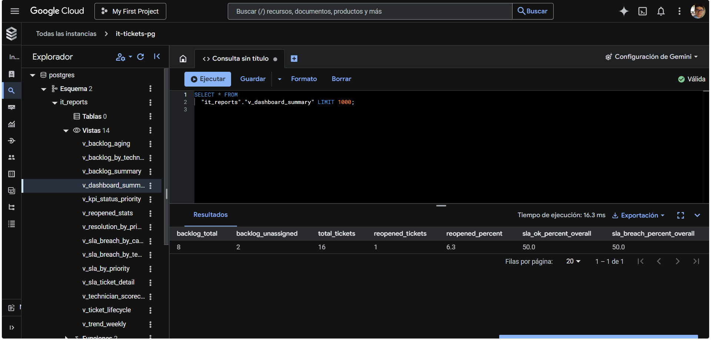
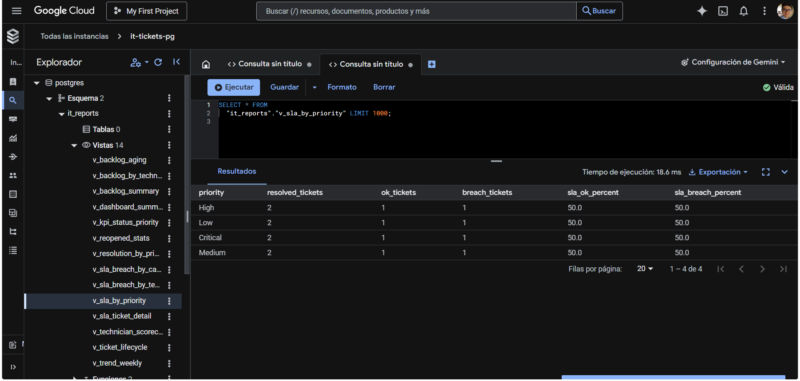
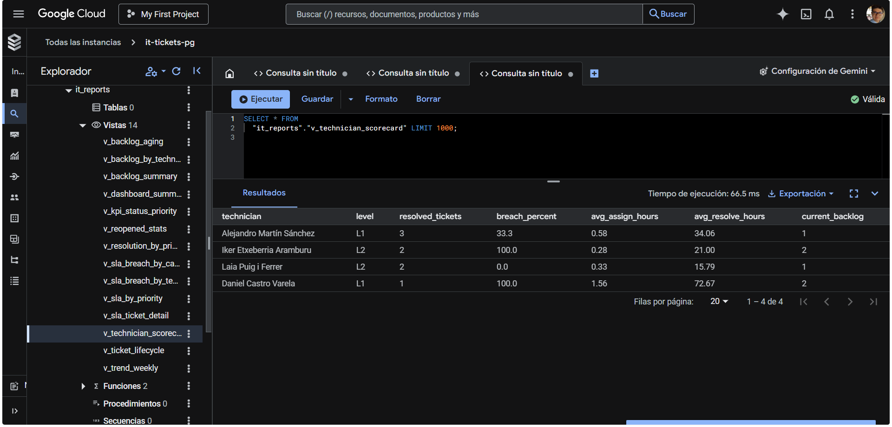

# IT Ticketing SQL Analytics (PostgreSQL)

A portfolio SQL project that models an IT support ticketing system and provides an enterprise-style reporting layer (views + materialized views) for operational KPIs: backlog, aging, SLA compliance, and technician performance.

## Tech Stack
- PostgreSQL (Cloud SQL / SQL Studio)
- SQL (CTEs, constraints, views, materialized views)
- Relational modeling (FKs + data quality rules)

## Project Structure
- `sql/00_schema.sql` – schemas + core tables
- `sql/01_seed_data.sql` – seed dataset (10 users, 4 technicians, 16 tickets)
- `sql/02_constraints.sql` – data-quality constraints
- `sql/03_views.sql` – reporting views (`it_reports.*`)
- `sql/04_materialized_views.sql` – materialized views + indexes
- `sql/05_refresh_functions.sql` – refresh functions for MVs
- `sql/06_roles_readonly.sql` – read-only reporting role/user

## Data Model
Core schema: `it_tickets`
- users, technicians, categories, assets, sla, tickets

Reporting schema: `it_reports`
- reporting views (`v_*`)
- materialized views (`mv_*`)

### Screenshots




### Refresh materialized views
```sql
SELECT it_reports.refresh_core_mviews();
-- or
SELECT it_reports.refresh_all_mviews();
